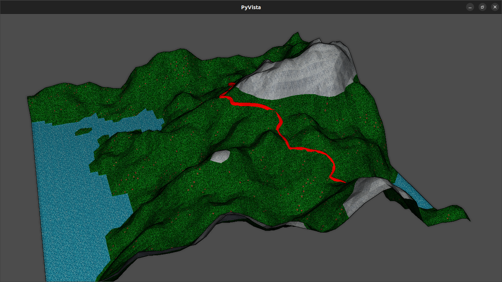

# 3D_world_generator
Procedural generation for a 3D 'realistic' world

features:
- fing most realistic path between 2 points

ToDo:
- make cleaner interface
- refactor code in `main.py`

## Installation


```bash
pip install -r requirements.txt
```

## Usage

```bash
python  pnoise_world_generator.py
```


